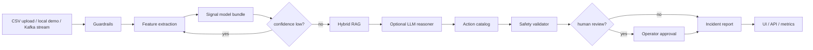

# Autonomous Manufacturing Fault Diagnosis and Self-Healing

Production-grade reference implementation for a LangGraph-powered multi-agent system that diagnoses rotating-machinery faults from vibration/RPM signals and produces safety-gated maintenance actions.

The default path is fully local and deterministic. Optional GenAI reasoning can be enabled through configuration when you want an LLM to summarize evidence or assist the operator workflow. No core behavior is hardcoded into the UI or API surface.

## What It Does

- Ingests vibration and RPM windows from CSV, synthetic demos, or API calls.
- Extracts signal features locally and scores them with a persisted model bundle.
- Routes incidents through a LangGraph workflow with guardrails, retrieval, prescription, safety validation, and human review.
- Loads prompts, maintenance policies, training scenarios, and knowledge snippets from config files.
- Supports optional chat-model reasoning with LangChain tool binding.
- Exposes the same core service through Gradio, FastAPI, Streamlit, and a local HTTP console.

## Architecture



The deeper system view lives in [docs/architecture.md](docs/architecture.md).

## Repository Layout

```text
.
|-- app.py                    # Gradio Space entrypoint
|-- app/                      # Optional Streamlit UI
|-- configs/                  # Default config, prompts, policies, scenarios
|-- docs/                     # Architecture, config, deployment, research notes
|-- examples/                 # Demo sensor CSVs
|-- k8s/                      # Kubernetes manifests
|-- scripts/                  # Local server, demo, manifest validation
|-- src/amfd/                 # Python package
|-- tests/                    # Unit and integration tests
`-- web/                      # Static local console assets
```

## Configuration

The runtime is driven by files, not embedded rules:

- `configs/default.yaml`
- `configs/actions.json`
- `configs/knowledge_base.json`
- `configs/prompts.json`
- `configs/training_scenarios.json`

The full reference is in [docs/configuration.md](docs/configuration.md).

## Quick Start

```bash
python -m venv .venv
. .venv/Scripts/activate
pip install -r requirements.txt
pip install -e ".[dev,backend,app,mlops,genai]"
```

## Run Locally

### Gradio Space entrypoint

```bash
python app.py
```

Open the printed local URL, load the demo window, or upload `examples/bearing_sample.csv`.

### Local HTTP console

```bash
python scripts/local_server.py
```

Open `http://127.0.0.1:8765` and use the browser UI.

### FastAPI backend

```bash
uvicorn amfd.backend.api:app --host 0.0.0.0 --port 8000 --reload
```

Useful endpoints:

- `GET /health`
- `GET /api/v1/demo`
- `POST /api/v1/diagnose`
- `POST /api/v1/diagnose/csv`

### Streamlit

```bash
streamlit run app/streamlit_app.py
```

### CLI

```bash
python -m amfd.run_diagnosis examples/bearing_sample.csv --machine-id PUMP-101
```

## Verify

```bash
python -m ruff format --check .
python -m ruff check .
python -m pytest -q
python eval.py
```

`eval.py` runs the synthetic evaluation harness and prints the current latency and F1 proxy.

## Optional GenAI

The system runs without any API key. If you want the optional reasoning node, set:

- `llm_provider`: `auto`, `openai`, `anthropic`, or `gemini`
- `llm_model`: explicit model name, or use the provider-specific `*_MODEL` env var

Common secrets for Hugging Face Spaces or local env files:

- `OPENAI_API_KEY`
- `ANTHROPIC_API_KEY`
- `GOOGLE_API_KEY`
- `KUBE_CONFIG` for Kubernetes deployment

The exact model and provider flow is documented in [docs/configuration.md](docs/configuration.md).

## Deployment

```bash
docker compose up --build
kubectl apply -f k8s/deployment.yaml
```

CI/CD and release details are in [docs/deployment.md](docs/deployment.md).

## Data Format

CSV input must contain a `vibration` column and can optionally include `rpm`.

Example:

```csv
vibration,rpm
0.01,1798
0.02,1801
0.04,1799
```

## Safety

This project emits advisory maintenance actions only. It does not directly actuate equipment. Critical actions remain behind safety validation and human review.

## Research Alignment

See [docs/research_notes.md](docs/research_notes.md) for the paper alignment, benchmark path, and dataset plan.
