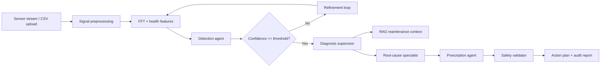

# Autonomous Manufacturing Fault Diagnosis and Self-Healing

LangGraph-powered agentic AI system for real-time industrial fault diagnosis, root-cause analysis, prescriptive maintenance, and safe recovery planning for rotating machinery.

The project is designed as an interview-grade, production-oriented reference implementation: streaming sensor ingestion, signal-processing tools, ML-style anomaly detection, multi-agent orchestration, RAG-ready maintenance context, audit-friendly action plans, and deployable MLOps scaffolding.

## What This Builds

- **Fault detection** from vibration/RPM streams using FFT features, statistical health indicators, and configurable anomaly thresholds.
- **Agentic diagnosis** with a LangGraph workflow that routes cases through detection, root-cause analysis, prescription, and validation nodes.
- **Self-healing recommendations** that emit structured, safety-gated JSON actions instead of free-form advice.
- **Synthetic fault augmentation hooks** for VAE-WGAN or RL-based data expansion experiments.
- **Operator dashboard** with CSV upload, waveform/FFT plots, diagnosis trace, and downloadable incident report.
- **MLOps baseline** with Docker, MLflow-friendly experiment entry points, Prometheus metrics hooks, and test coverage.

## Architecture



## Repository Layout

```text
.
├── app/                         # Streamlit operator dashboard
├── configs/                     # Runtime and threshold config
├── docs/                        # Architecture and research notes
├── examples/                    # Demo sensor files
├── src/amfd/                    # Python package
│   ├── agents/                  # LangGraph workflow nodes
│   ├── core/                    # Config, domain models, safety policy
│   ├── data/                    # Ingestion and synthetic data helpers
│   ├── ml/                      # Features, anomaly scoring, augmentation hooks
│   ├── rag/                     # Maintenance knowledge retriever
│   └── telemetry/               # Metrics and tracing helpers
└── tests/                       # Unit and workflow tests
```

## Quick Start

```bash
python -m venv .venv
. .venv/Scripts/activate
pip install -e ".[dev,app]"
pytest
streamlit run app/streamlit_app.py
```

For a no-dataset demo, use `examples/bearing_sample.csv` in the dashboard.

## CLI Demo

```bash
python -m amfd.run_diagnosis examples/bearing_sample.csv --machine-id PUMP-101
```

The command prints a JSON incident report with detection evidence, inferred root cause, recommended recovery steps, and validation status.

## Research Basis

This implementation is inspired by multi-agent self-healing manufacturing lines and LLM-based fault-diagnosis research. It adapts those ideas to rotating-equipment diagnostics where vibration features, FFT signatures, and maintenance history can be combined with agentic reasoning.

The code intentionally keeps safety-sensitive actuation behind a validator. Recovery output is a recommended plan, not direct machine control.

## Roadmap

- Add CWRU bearing dataset loader and benchmark scripts.
- Replace heuristic detector with trained CNN/transformer fault classifier.
- Add FAISS-backed retrieval over manuals, CMMS tickets, and historical incidents.
- Add MLflow experiment tracking for augmentation and detector comparison.
- Add Kubernetes manifests and online streaming ingestion through Kafka.

