# Autonomous Manufacturing Fault Diagnosis and Self-Healing

Production-grade reference implementation for a LangGraph-powered multi-agent system that diagnoses rotating-machinery faults from vibration/RPM signals and emits safety-gated self-healing maintenance plans.

The project is intentionally deployable without an API key: deterministic signal tools run locally, while the agent/tool registry is ready for Claude, GPT, Gemini, Llama, vLLM, or any LangChain-compatible chat model through `.bind_tools()`.

## Architecture Diagram

```mermaid
flowchart LR
    A["Kafka stream / CSV upload"] --> B["Supervisor agent"]
    B --> C["Guardrails + PII redaction"]
    C --> D["DataAug specialist<br/>VAE-WGAN-GP hook"]
    D --> E["Detector specialist<br/>FFT + anomaly tools"]
    E --> F{"confidence >= policy?"}
    F -- "No" --> D
    F -- "Yes" --> G["Analyzer specialist<br/>causal inference"]
    G --> H["Hybrid RAG<br/>BM25 + ColBERT-style rerank"]
    H --> I["Prescriber specialist<br/>JSON recovery plan"]
    I --> J["Safety validator"]
    J --> K{"human review needed?"}
    K -- "Yes" --> L["Human-in-loop approval"]
    K -- "No" --> M["Incident report"]
    L --> M
    M --> N["Streamlit + MLflow + Prometheus"]
```



## What Is Included

- LangGraph `StateGraph` workflow with cycles, conditional edges, persistence, and a human-review branch.
- Supervisor plus specialist agents: Guardrails, DataAug, Detector, Analyzer, RAG, Prescriber, Safety.
- A2A communication through typed `AgentMessage` objects in the graph state.
- Six custom LangChain tools bound through `bind_manufacturing_tools(llm)`.
- Hybrid retrieval scaffold with BM25 scoring and lightweight ColBERT-style late-interaction reranking.
- VAE-WGAN-GP augmentation hook for future trained synthetic fault generation.
- Kafka consumer scaffold for streaming `SensorWindow` payloads.
- Streamlit dashboard with CSV upload, Plotly visualization, RAG evidence, metrics, and JSON reports.
- MLOps assets: MLflow tracker, Prometheus metrics, Docker, Kubernetes, GitHub Actions, eval harness.
- Security layer: local guardrails, prompt-injection checks, email/phone redaction, safety validator.

## Repository Layout

```text
.
|-- app/                         # Streamlit operator dashboard
|-- configs/                     # Runtime and threshold config
|-- docs/                        # Architecture, prompts, research notes
|-- examples/                    # Demo sensor files
|-- k8s/                         # Kubernetes manifests
|-- src/amfd/                    # Python package
|   |-- agents/                  # LangGraph workflow, prompts, tools, LLM binding
|   |-- core/                    # Config, domain models, safety policy
|   |-- data/                    # CSV ingestion, synthetic data, Kafka streaming
|   |-- ml/                      # Features, anomaly scoring, augmentation hook
|   |-- mlops/                   # MLflow tracking
|   |-- rag/                     # Hybrid retriever
|   |-- security/                # Guardrails and PII redaction
|   `-- telemetry/               # Metrics helpers
`-- tests/                       # Unit and workflow tests
```

## Quick Start

```bash
python -m venv .venv
. .venv/Scripts/activate
pip install -r requirements.txt
pip install -e ".[dev,backend,app,mlops]"
pytest
```

## Run It Locally

### Option A: zero-extra local console

This path runs the API and browser frontend with the same local Python environment used by the core package.

```bash
$env:PYTHONPATH="src"
python scripts/local_server.py
```

Open [http://127.0.0.1:8765](http://127.0.0.1:8765), click **Run Demo**, or upload `examples/bearing_sample.csv`.

### Option B: production FastAPI backend

```bash
uvicorn amfd.backend.api:app --host 0.0.0.0 --port 8000 --reload
```

Useful checks:

```bash
curl http://127.0.0.1:8000/health
curl http://127.0.0.1:8000/api/v1/demo
```

### Option C: Streamlit dashboard

```bash
streamlit run app/streamlit_app.py
```

## CLI Demo

```bash
python -m amfd.run_diagnosis examples/bearing_sample.csv --machine-id PUMP-101
```

## Eval

```bash
python eval.py
```

Current local synthetic benchmark target:

| Metric | Target | Harness |
| --- | ---: | --- |
| Fault-class F1 proxy | > 0.95 | `eval.py` synthetic bearing cases |
| Diagnosis latency | < 2000 ms | graph end-to-end timer |
| Safety approval traceability | 100% | typed report validation |
| Operator explainability | 100% reports include evidence | RAG + detector evidence |

These are engineering targets, not claims about the untrained baseline on CWRU/PU. Real benchmark numbers should be reported after training/evaluating against CWRU and Paderborn splits.

## Deployment

```bash
docker compose up --build
kubectl apply -f k8s/deployment.yaml
```

## CI/CD

GitHub Actions runs a full correctness gate on every PR and push to `main`:

- Ruff format and lint checks.
- Mypy over `src` and `tests`.
- Pytest with coverage.
- Synthetic evaluation smoke test.
- Backend service smoke test.
- Docker image build.
- Kubernetes manifest dry-run validation.

Release flow:

1. Push a version tag such as `v0.1.0`, or run the `cd` workflow manually.
2. The pipeline builds and pushes `ghcr.io/naman-fr/amfd-api`.
3. Kubernetes deployment is gated behind the repository variable `ENABLE_K8S_DEPLOY=true`, the `production` environment, and a `KUBE_CONFIG` secret.

Production notes:

- Run Streamlit separately from graph workers for high-throughput streaming use cases.
- Use Kafka for sensor windows and persist graph checkpoints to Redis/Postgres in production.
- Replace the heuristic detector with a trained CNN/transformer/TensorRT model behind the same tool interface.
- Run vLLM/TensorRT-LLM as an inference backend when using local open-weight models.
- Keep all maintenance actions advisory until integrated with plant-approved PLC/SCADA controls.

## Demo Video Script

1. Open the dashboard and upload `examples/bearing_sample.csv`.
2. Show waveform, anomaly score, root cause, and RAG evidence.
3. Open the JSON report and highlight the agent trace.
4. Force human review through metadata in a CLI run and show the review branch.
5. Run `python eval.py` and show latency/F1 target output.
6. Show Docker/K8s/CI files to demonstrate deployability.

## Research Alignment

- Kevin Patel, "Agentic AI for Self-Healing Production Lines: Autonomous Root Cause Analysis & Correction", JISEM, 2024. DOI: 10.52783/jisem.v9i4s.12427.
- Xian Yeow Lee, Lasitha Vidyaratne, Ahmed Farahat, Chetan Gupta, "Exploring LLM-based Agentic Frameworks for Fault Diagnosis", PHM Society, 2025. DOI: 10.36001/phmconf.2025.v17i1.4350.
- CWRU Bearing Data Center and Paderborn University Bearing Data Center are the intended benchmark data sources for seeded and naturally damaged bearing faults.

## Safety

This project generates advisory maintenance plans only. It does not directly actuate industrial equipment. Critical actions require approval through the safety and human-review layers before plant integration.
