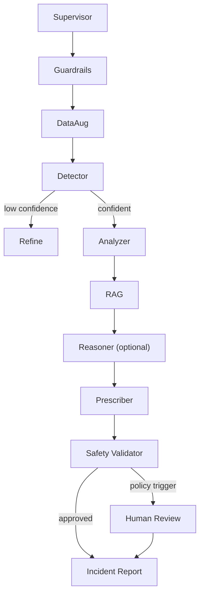

# System Architecture

The system is a stateful LangGraph workflow with typed state, conditional edges, and optional human review. Each step consumes the current incident state, enriches evidence, and returns a structured update. The graph is designed so deterministic signal logic does the heavy lifting and the GenAI layer stays advisory and optional.

## Agent Responsibilities

- **Supervisor agent** owns routing, persistence, escalation, and final report assembly.
- **Guardrails agent** redacts sensitive operator text and blocks unsafe instructions.
- **DataAug agent** exposes VAE-WGAN-GP style augmentation for training and simulation only.
- **Detector agent** computes vibration features and classifies machine health from the persisted model bundle.
- **Analyzer agent** turns feature evidence into ranked root-cause hypotheses.
- **RAG agent** retrieves maintenance context with BM25 plus reranking over the file-backed knowledge base.
- **Reasoner agent** is optional and uses the configured GenAI provider to refine the explanation and next-step summary.
- **Prescription agent** emits structured maintenance actions and recovery steps.
- **Safety validator** blocks unsupported actions and records why they were rejected.
- **Human review node** captures approval metadata for critical, ambiguous, or policy-triggered cases.

## Graph Flow



## Runtime Layers

```mermaid
flowchart LR
    browser["Streamlit UI"] --> api["FastAPI backend"]
    browser --> local["Local demo server"]
    api --> service["DiagnosisService"]
    local --> service
    service --> graph["LangGraph workflow"]
    graph --> bundle["Persisted signal model bundle"]
    graph --> prompts["File-backed prompts"]
    graph --> policies["File-backed actions and policies"]
    graph --> tools["FFT, anomaly, causal, safety tools"]
    graph --> rag["Hybrid RAG"]
    graph --> llm["Optional GenAI provider"]
    graph --> report["IncidentReport JSON"]
    report --> mlflow["MLflow"]
    report --> prom["Prometheus"]
```

## Production Notes

- Treat generated actions as advisory until connected to a plant-approved control layer.
- Persist each state transition for auditability and replay.
- Keep thresholds machine-specific; a single global threshold is only suitable for demos.
- Benchmark latency separately for signal processing, model inference, retrieval, and orchestration.
- The prompt library and maintenance actions live in `configs/prompts.json` and `configs/actions.json`, so they can be updated without code changes.
