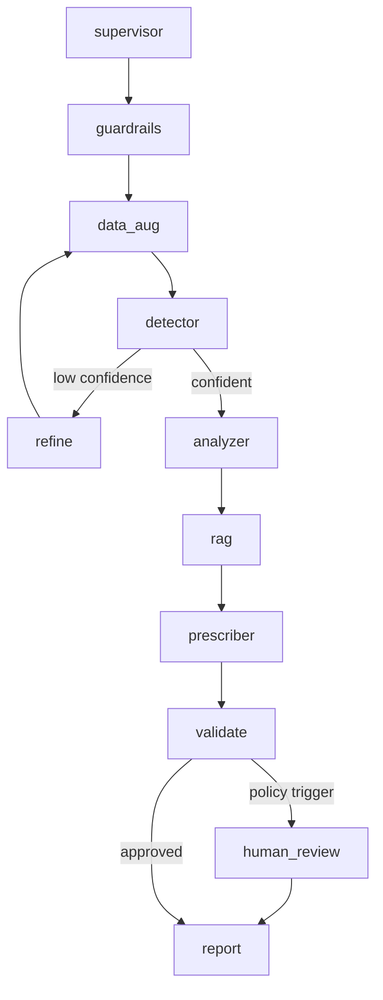

# System Architecture

The system follows a stateful LangGraph workflow. Each node receives an incident state, adds evidence, emits A2A messages, and returns a typed update. Conditional edges route low-confidence cases through a refinement loop and route unsafe/ambiguous cases through human review.

## Agent Responsibilities

- **Supervisor agent** owns routing, persistence, and escalation decisions.
- **Guardrails agent** redacts PII and blocks prompt-injection style operator notes.
- **DataAug agent** prepares features and exposes the VAE-WGAN-GP augmentation boundary.
- **Detector agent** computes vibration features and classifies health status.
- **Analyzer agent** maps feature evidence to mechanical root-cause hypotheses.
- **RAG agent** retrieves maintenance context using BM25 and late-interaction reranking.
- **Prescription agent** produces structured maintenance actions.
- **Safety validator** blocks unsafe or unsupported actions and records why.
- **Human review node** records approval metadata for critical or policy-triggered cases.

## Production Notes

- Treat generated actions as advisory until connected to a plant-approved control layer.
- Persist each state transition for auditability.
- Keep thresholds machine-specific; a single global threshold is only suitable for demos.
- Benchmark latency separately for signal processing, model inference, retrieval, and orchestration.

## Graph Nodes



## Runtime Layers

```mermaid
flowchart LR
    browser["Web console / Streamlit"] --> api["FastAPI backend"]
    browser --> local["Local stdlib server"]
    api --> service["DiagnosisService"]
    local --> service
    service --> graph["LangGraph workflow"]
    graph --> tools["FFT, anomaly, causal, prescription, safety tools"]
    graph --> rag["Hybrid RAG"]
    graph --> report["IncidentReport JSON"]
    report --> mlflow["MLflow"]
    report --> prom["Prometheus"]
```

